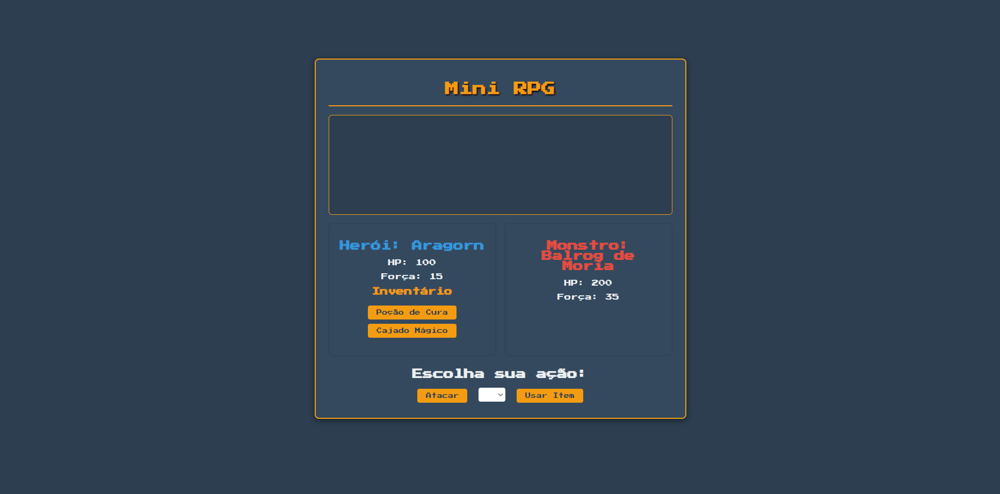

<h1 align= "center">RPG Simples<h1>

<a href="#tecnologias">TECNOLOGIAS</a>|
<a href="#️-projeto">PROJETO</a>|
<a href="#memo-licença">LICENÇA</a>|
<a href="#-made-by">MADE BY</a>

  

    

## 🚀 Tecnologias

Esse Projeto Foi desenvolvido usando as seguintes Tecnologias

- HTML e CSS
 
- JavaScript
 
- Git e Github

## 🖥️ Projeto

O RPG Simples foi um projeto feito com o intuito de aprimorar minhas habilidades e entendimento sobre lógica e uso de classes no JS. 

## 👨‍💻 Made by 

Feito por Samuelfa

## :memo: Licença

Esse projeto está sob licença a MIT. 
